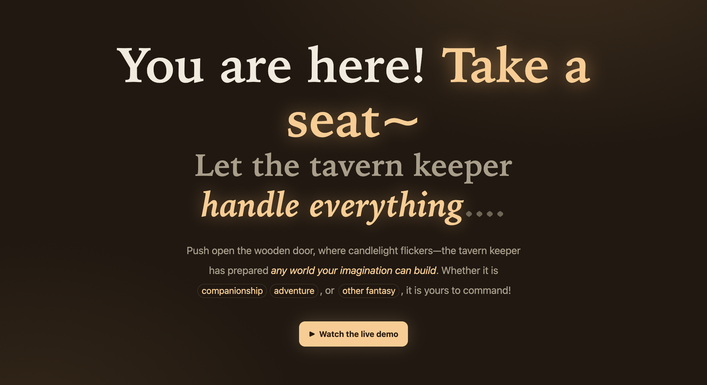

<p align="center">
  <a href="https://rannichan.github.io/Tavern-Harness/">
    
  </a>
</p>
<p align="center">
  <a href="https://github.com/Rannichan/Tavern-Harness"></a>
  <a href="https://discord.gg/kPSWGeaHx"></a>
  <a href="https://rannichan.github.io/Tavern-Harness/wiki.html"></a>
  <a href="https://www.npmjs.com/package/tavern-harness"></a>
</p>

# Tavern Harness · An AI-Native Role-Playing Sandbox

<a id="demo"></a>
## 1 · Gameplay Demos

[](https://rannichan.github.io/Tavern-Harness/index.html#demo)

<a id="run"></a>
## 2 · Getting Started

### Option 1: One-Command Start (Recommended)

No repository clone or global installation is required:

```bash
npx tavern-harness
```

The first run downloads the package, starts the local service, and opens your browser automatically. Optional arguments:

```bash
npx tavern-harness --no-open
npx tavern-harness --port 5273
```

### Option 2: Global Installation (Recommended for Regular Use)

Install once, then start Tavern Harness from any directory:

```bash
npm install -g tavern-harness
tavern-harness
```

To update it:

```bash
npm update -g tavern-harness
```

To uninstall it:

```bash
npm uninstall -g tavern-harness
```

### Option 3: Build from Source

```bash
git clone https://github.com/Rannichan/Tavern-Harness.git
cd Tavern-Harness
npm install
npm run dev      # Defaults to port 5173 and automatically tries the next port if occupied
```

### Configure a Model Provider on First Launch

After starting the app, open **Settings → Model Service Provider**:

1. **Add a provider**: enter a name, Base URL, and API Key. Any OpenAI-compatible `chat/completions` API is supported, including OpenAI, DeepSeek, Qwen, SiliconFlow, Ollama, LM Studio, and self-hosted vLLM.
2. **Test the connection**: the app fetches the model list automatically. If the target service does not expose CORS headers, requests are forwarded through the built-in same-origin proxy for private-network or LAN addresses. On success, the Base URL is rewritten to its proxy form and saved.
3. **Select a model**: click the model name at the top of the chat page, then return to the conversation and start chatting.

### Automatic Tool Approval (YOLO Mode)

Enable **Settings → Tool execution → YOLO mode** to automatically approve tool changes and Shell commands during conversations. It is off by default, is saved locally, and can be disabled at any time. Only enable it for characters and skills you trust. Agent execution limits still require manual continuation.

### Data Privacy

- **All data is stored in browser IndexedDB**: conversations, character cards, lorebooks, skills, statistics, and API keys are not uploaded to any server.
- Data is tied to the browser, port, and site origin. Switching browsers, opening a private window, or using a different port will not show existing data. This is expected browser security behavior; use the same browser and port each time.

<a id="features"></a>
## 3 · Features

### 🍺 The Tavern Keeper Is Always Ready to Help

Whether you are creating a character card, designing a tabletop RPG scenario, or simply unsure where to begin, ask the Tavern Keeper.

The tavern is designed around AI assistance to make creating and playing games easier.

### 🛠️ Skill System

Characters are more than chat partners: they are **agents with extensible skills**. Equip each character with the abilities needed for richer gameplay.

The tavern includes essential skills such as dice rolling. You can also ask the Tavern Keeper to **create any skill you need**.

### 💬 Multi-Character Group Chats

Each room supports up to **six characters** and provides a turn-order board for managing group conversations.

Use **@mentions** and **skip** to create natural multi-character scenes—whether observing from above or role-playing as part of the group.

### 🎁 Share Your Game with Friends

Compatible with the **Tavern ecosystem**, including one-click PNG character-card imports.

You can also export and share an entire game: recipients can import it and play immediately without manually creating characters, skills, or conversation settings.

### 🍃 Fully Local and Clean

The app supports **OpenAI-format APIs**. Use a hosted API plan or run a model locally; your data remains on your device.

The project has no external harness dependency, and its UI is designed for a clean, focused experience.

<a id="feedback"></a>
## 4 · Community and Feedback

- 🐛 Found a bug or have a feature request? Open a [GitHub Issue](https://github.com/Rannichan/Tavern-Harness/issues). You are welcome to attach exported game JSON or browser-console logs, but always remove API keys first.
- 🟣 For usage discussions, gameplay ideas, character and skill sharing, or development updates, join the [Discord community](https://discord.gg/kPSWGeaHx).
- 🤝 Pull requests are welcome.
- 📣 Star or watch the repository to receive updates.

> The tavern is open 24 hours a day, and the Keeper is always here to help.

## License

This project is licensed under the [MIT License](LICENSE).
