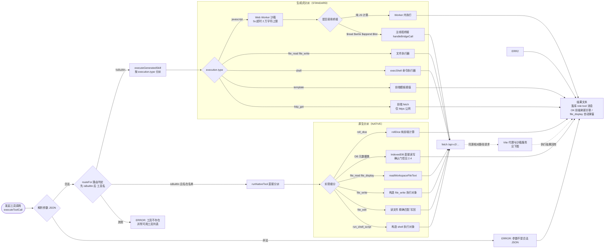
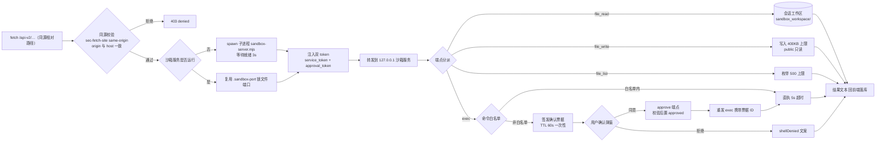

# 技能沙箱设计

> 本文档介绍 Tavern-Harness 中技能（Skill）沙箱的整体设计，待完善。

## 1. 分类总览

技能按**实现边界**分为三层，而非简单地按"是否内置"区分：

### 1.1 内置原生工具（NATIVE 路由）

注册在 `BUILTIN_TOOL_NAMES` 且 `isBuiltIn` 为真（`routeFor()` 返回 `'NATIVE'`）。执行时由前端 `runNativeTool` 直接分派，不依赖沙箱服务。具体分为三类：

| 技能分类 | 工具 | 备注 |
| --- | --- | --- |
| 纯前端逻辑 | `roll_dice` | 与 App 的 DiceRoller 一致 |
| 数据库 / 元数据操作（IndexedDB） | 技能 CRUD `create_skill` / `update_skill` / `delete_skill` | 新技能默认未对任何角色启用 |
| 数据库 / 元数据操作（IndexedDB） | 角色 CRUD `create_character` / `update_character` / `delete_character` | |
| 数据库 / 元数据操作（IndexedDB） | 世界书 CRUD `create_lorebook` / `update_lorebook` / `delete_lorebook` | |
| 数据库 / 元数据操作（IndexedDB） | 信息查询 `get_tavern_info` / `get_character_info` / `get_lorebook_info` | |
| 数据库 / 元数据操作（IndexedDB） | 会话创建 `create_conversation` | |

> 确认门控：`update_*` / `delete_*` 系列会发起确认弹窗，取消则返回 `CANCELLED` 

### 1.2 内置但复用沙箱管道的工具

名字上是内置工具（同样注册在 `BUILTIN_TOOL_NAMES`，NATIVE 路由分派），但执行依赖会话工作区 / 沙箱服务。实现路径与所用端点如下：

| 工具 | 前端实现路径 | 请求端点 | 备注 |
| --- | --- | --- | --- |
| `run_shell_script` | 构造 `{ type: 'shell' }` 调 `executeGeneratedSkill` | `/api-v2/exec` | 白名单直执 + 非白名单确认票据 |
| `file_write` | 构造 `{ type: 'file_write' }` 调 `executeGeneratedSkill` | `/api-v2/file_write` | |
| `file_read` | 直接调 `readWorkspaceFileText`（不构造执行对象） | `/api-v2/file_read` | |
| `file_edit` | 自实现：`readWorkspaceFileText` 读文件 + `old_text` 精确匹配校验，经 `writeWorkspaceFileTextFor` 写回 | `/api-v2/file_write` | |
| `file_display` | 复用 `readWorkspaceFileText` 读取文件，按扩展名推断 html / image / text 展示方式，产生展示载荷交给前端弹窗 | `/api-v2/file_read` | 弹窗只读展示；模型如需阅读全文应改用 `file_read` |

> 所有端点均为前端 `fetch` 同源相对路径 `/api-v2/…`，由 Vite 开发服务器代理转发到本机沙箱服务（`sandbox-server.mjs`，默认 `127.0.0.1:17891`）。

### 1.3 生成式技能（STANDARD 路由，create_skill 产物）

由 `create_skill` 创建，`executionJson` 中声明 `execution.type`，执行时按类型分派到不同的隔离机制：

| 执行类型 | 实现机制 | 是否走沙箱服务 |
| --- | --- | --- |
| `template` | 纯前端模板插值（`{{param}}` 占位符） | 否 |
| `http_get` | 前端 fetch，仅允许 https 公网，屏蔽内网 | 否 |
| `javascript` | Web Worker + CSP 沙箱（浏览器内），5s 超时、2 万字符上限 | 代码执行否；若调用 `$read`/`$write`/`$append`/`$list` 则经桥接请求 `/api-v2/file_*` |
| `file_read` / `file_write` | 会话工作区真实文件系统 | 是（请求 `/api-v2/file_read` / `/api-v2/file_write`） |
| `shell` | 受控本地命令执行 | 是（请求 `/api-v2/exec`） |

## 2. 工具路由与执行流

### 2.0 执行流程（从发起工具调用开始）

统一从**一次工具调用被发起**（回合循环执行 `executeToolCall`）开始画，不回溯模型生成阶段；`getEnabledToolsForSession` 属于请求构建阶段（见 2.2），不在图中。下图一覆盖前端侧分派，图二覆盖请求打到 `/api-v2/…` 之后的 Vite 代理与沙箱服务侧：

第一张图只到前端的分派与执行机制；凡是需要真实文件系统 / 本地命令的能力都汇聚到 `fetch /api-v2/…`，由第二张图接管。以下小节为文字细节。

### 2.1 路由判定（routeFor）

`src/core/tools/toolExecutor.ts` 中 `routeFor()` 对每次工具调用返回三种路由之一，按**判定优先级**依次为：

| 优先级 | 路由 | 判定条件 | 处置 |
| --- | --- | --- | --- |
| 1 | `STANDARD` | 记录存在且非内置（`!isBuiltIn`） | 解析 `executionJson` 按 `execution.type` 分派到 `executeGeneratedSkill`（见 1.3） |
| 2 | `NATIVE` | 走到此步必然 `isBuiltIn` 为真；工具名命中 `BUILTIN_TOOL_NAMES` | 前端 `runNativeTool` 直接分派（见 1.1 / 1.2） |
| 3 | `BLOCKED` | 其余：工具不存在 / 记录为 null / 内置但名字不在名单 | 返回 `ERROR: 工具 'xxx' 不存在或不可用`，并附带可用工具列表 |

### 2.3 三层防线（预算限制）

每回合的ReAct深度循环受三类预算约束，超出即弹窗请求用户确认是否继续（拒绝则中断回合）：

| 限制 | 常量 | 行为 |
| --- | --- | --- |
| 调用深度 | `MAX_TOOL_CALL_DEPTH = 10` | 每层循环入口检查 `depth >= 10` 时确认 |
| 每回合工具调用数 | `MAX_TOOL_CALLS_PER_TURN = 20` | 达到 20 次后确认 |
| 相同签名连续调用 | `MAX_IDENTICAL_TOOL_CALLS = 3` | 同 `name+argumentsJson` 连续 3 次后确认 |
| 连续失败 | `MAX_CONSECUTIVE_TOOL_FAILURES = 3` | 连续 3 次失败后确认；后续失败再触发 |

确认通过则 `resetToolBudgets()` 重置计数继续；拒绝则置 `limitDeclined`，本回合剩余工具全部返回取消文案并结束循环。

### 2.4 确认门控的两个入口

对同批 `update_skill` / `delete_skill` / `update_character` / `delete_character` / `update_lorebook` / `delete_lorebook` 六把工具，确认弹窗有两个调用入口：回合循环的**外层白名单**与 `runNativeTool` 内的**内层 `gate()`**。二者都基于 `ToolConfirmationRequest { sessionId, toolName, title, message, argsJson }`。

| 维度 | 入口 A：循环外层白名单（主入口） | 入口 B：路由内 `gate()`（兜底） |
| --- | --- | --- |
| 触发工具 | 同一批六把工具，按工具名匹配（**不论 `isBuiltIn`**，同名自定义技能同样被拦） | 同一批六把工具进入 `NATIVE` 路由后 |
| 触发时机 | `executeToolCall` **之前**（`store.ts` 的 `needsConfirm` 白名单） | `runNativeTool` 分派到具体 case 后、写库实现执行前 |
| 确认内容 | `argsJson: tc.argumentsJson`（完整参数，用户能看到要改/删哪个对象） | `argsJson: '{}'`（不透传参数） |
| 回调实现 | `requestToolConfirmation(sessionId, tc)`，挂起直到用户响应 | `ctx.requestConfirmation`（由调用方注入） |
| 通过后行为 | 注入 `async () => true` 作为内层回调，`gate()` 直接放行，不二次弹窗 | 继续执行对应实现 |
| 取消行为 | 不进入 `executeToolCall`（不解析参数、不查库、不执行实现），直接置取消文案 | 返回取消文案（`toast.canceled`） |

**两者关系**：内层 `gate()` 是外层白名单的兜底——即使未来出现绕过 `needsConfirm` 分支的调用路径（例如别处直接调 `executeToolCall`），破坏性写操作仍必须确认；当前正常路径中外层总是先拦截，内层拿到的回调恒为 `async () => true`。

> 注：生成式 shell 技能的非白名单命令确认（`requestGeneratedToolConfirmation`，请求结构同为 `ToolConfirmationRequest`）**不属于**这两个入口——它经 `executeToolCall` 的 `requestConfirmation` 参数在执行过程中按需注入，见 3.3。

### 2.5 工具结果与重试

- 工具执行抛异常（网络 / 沙箱 / 安全拦截）不会中断回合，而是落库 `ERROR: …` 并提示 toast。
- 空结果（空模板 / 空文件 / 空输出）补为 `tool.noResult` 占位文案。
- `IDENTICAL` 签名撞限、`fetch` 失败、`CANCELLED` 均不累计连续失败；用户主动取消（`CANCELLED`+取消文案）不算失败。
- 连续失败达 `MAX_CONSECUTIVE_TOOL_FAILURES` 时可确认重置继续，拒绝则本回合工具调用全部终止。

### 2.6 端点与代理链路

前端统一 `fetch` 同源相对路径 `/api-v2/…`，由 Vite 代理插件 `sandboxProxyPlugin` 处理（`vite.config.ts`）：

| 端点 | 触发者 | 沙箱服务处理 | 说明 |
| --- | --- | --- | --- |
| `/api-v2/exec` | `file_read` 外的 shell 类（`run_shell_script` / 生成式 `shell`） | 白名单直执，或签发票据等批准 | 见 3.3 |
| `/api-v2/approve` | 用户确认后 `approveSandboxScript` | 票据置 approved（一次性，TTL 60s） | 见 3.3 |
| `/api-v2/file_read` | `file_read` / `file_display` / JS 桥接 `$read` | 读取会话工作区相对路径 | 上限 100k 字符 |
| `/api-v2/file_write` | `file_write` / `file_edit` / JS 桥接 `$write`/`$append` | 写入会话工作区（public 只读） | 上限 400KB |
| `/api-v2/file_list` | JS 桥接 `$list` / `listSessionWorkspaceFiles` | 枚举会话工作目录 | 上限 500 个 |
| `/api-v2/session_create` / `session_delete` | 会话创建 / 删除时 | 预建 / 清理专属目录 | 失败静默 |

代理层关键行为（见第一张图的 Vite 块）：

1. **校验收发**：仅转发 `POST` 且必须同源（`sec-fetch-site: same-origin` 且 `origin` 与 `host` 一致），否则 403。
2. **自动拉起**：`ensureSandbox` 优先复用已在运行的沙箱（读 `.sandbox-port` 锁文件），否则 `spawn(process.execPath, [sandbox-server.mjs, port])` 拉起子进程并等待就绪（最多 3s）。
3. **双 token 注入**：每次 dev server 启动生成 `service_token` / `approval_token`（各 `randomBytes(32)`），经环境变量传给沙箱子进程；无密钥直连 127.0.0.1 的请求被拒，`/api-v2/approve` 必须持有 approval token（见 README 描述与 `vite.config.ts`）。
4. **生命周期**：dev server 退出（`closeBundle`）或 `sandbox-server.mjs` 文件变更时停掉子进程；沙箱仅监听 `127.0.0.1`。

## 3. 沙箱边界

### 3.1 JavaScript 沙箱（Web Worker + CSP）

（待完善：Worker 隔离、桥接 Pending、超时与终止）

### 3.2 文件沙箱

（待完善：会话工作区目录规则、public 只读、路径校验、单文件上限）

### 3.3 命令沙箱（sandbox-server）

（待完善：白名单命令直执、非白名单票据确认、命令数/超时/输出限制、仅监听 127.0.0.1）

## 4. 会话工作区

（待完善：`applySessionWorkspace` 目录选择规则、session-<id> 专属目录、内置酒馆老板固定 public、目录生命周期）

## 5. 技能 CRUD 与启用

（待完善：create_skill 参数校验、update/delete 保护、新技能默认未启用、update_character 的 enable_skills）

## 6. 安全模型小结

（待完善：双 token 机制、确认票据、路径穿越防护、命令白名单、超时限制）

## 7. 与其他模块的交互

（待完善：工具确认弹窗链路、turnLoop 工具调用循环、CORS 代理 / 沙箱服务的启动方式）