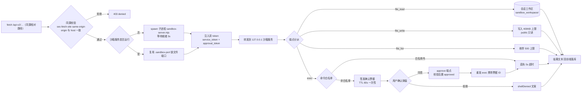
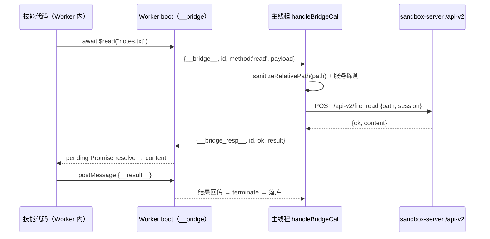
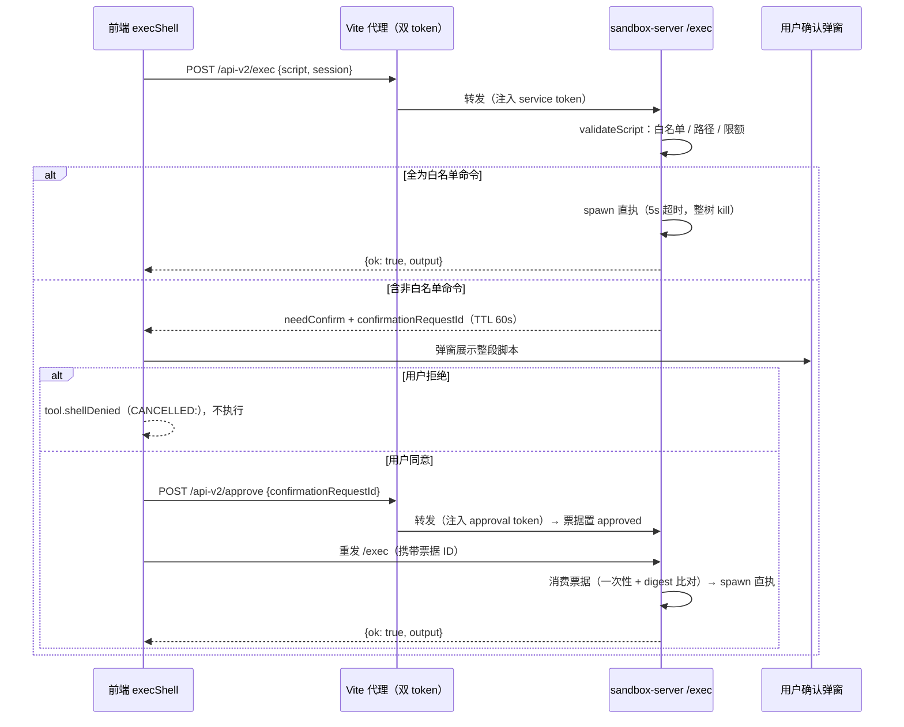

# 技能沙箱设计

> 本文档介绍 Tavern-Harness 中技能（Skill）沙箱的整体设计，待完善。

## 1. 分类总览

技能按**实现边界**分为三层，而非简单地按"是否内置"区分：

### 1.1 内置原生工具（NATIVE 路由）

注册在 `BUILTIN_TOOL_NAMES` 且 `isBuiltIn` 为真（`routeFor()` 返回 `'NATIVE'`）。执行时由前端 `runNativeTool` 直接分派，不依赖沙箱服务。具体分为三类：

| 技能分类 | 工具 | 备注 |
| --- | --- | --- |
| 纯前端逻辑 | `roll_dice` | 与 App 的 DiceRoller 一致 |
| 数据库 / 元数据操作（IndexedDB） | 技能 CRUD `create_skill` / `update_skill` / `delete_skill` | 新技能默认未对任何角色启用 |
| 数据库 / 元数据操作（IndexedDB） | 角色 CRUD `create_character` / `update_character` / `delete_character` | |
| 数据库 / 元数据操作（IndexedDB） | 世界书 CRUD `create_lorebook` / `update_lorebook` / `delete_lorebook` | |
| 数据库 / 元数据操作（IndexedDB） | 信息查询 `get_tavern_info` / `get_character_info` / `get_lorebook_info` | |
| 数据库 / 元数据操作（IndexedDB） | 会话创建 `create_conversation` | |

> 确认门控：`update_*` / `delete_*` 系列会发起确认弹窗（统一由外层白名单确认，见 2.4），取消则返回 `CANCELLED` 

### 1.2 内置但复用沙箱管道的工具

名字上是内置工具（同样注册在 `BUILTIN_TOOL_NAMES`，NATIVE 路由分派），但执行依赖会话工作区 / 沙箱服务。实现路径与所用端点如下：

| 工具 | 前端实现路径 | 请求端点 | 备注 |
| --- | --- | --- | --- |
| `run_shell_script` | 构造 `{ type: 'shell' }` 调 `executeGeneratedSkill` | `/api-v2/exec` | 白名单直执 + 非白名单确认票据 |
| `file_write` | 构造 `{ type: 'file_write' }` 调 `executeGeneratedSkill` | `/api-v2/file_write` | |
| `file_read` | 直接调 `readWorkspaceFileText`（不构造执行对象） | `/api-v2/file_read` | |
| `file_edit` | 自实现：`readWorkspaceFileText` 读文件 + `old_text` 精确匹配校验，经 `writeWorkspaceFileTextFor` 写回 | `/api-v2/file_write` | |
| `file_display` | 复用 `readWorkspaceFileText` 读取文件，按扩展名推断 html / image / text 展示方式，产生展示载荷交给前端弹窗 | `/api-v2/file_read` | 弹窗只读展示；模型如需阅读全文应改用 `file_read` |

> 所有端点均为前端 `fetch` 同源相对路径 `/api-v2/…`，由 Vite 开发服务器代理转发到本机沙箱服务（`sandbox-server.mjs`，默认 `127.0.0.1:17891`）。

### 1.3 生成式技能（STANDARD 路由，create_skill 产物）

由 `create_skill` 创建，`executionJson` 中声明 `execution.type`，执行时按类型分派到不同的隔离机制：

| 执行类型 | 实现机制 | 是否走沙箱服务 |
| --- | --- | --- |
| `template` | 纯前端模板插值（`{{param}}` 占位符） | 否 |
| `http_get` | 前端 fetch，仅允许 https 公网，屏蔽内网 | 否 |
| `javascript` | Web Worker + CSP 沙箱（浏览器内），5s 超时、2 万字符上限 | 代码执行否；若调用 `$read`/`$write`/`$append`/`$list` 则经桥接请求 `/api-v2/file_*` |
| `file_read` / `file_write` | 会话工作区真实文件系统 | 是（请求 `/api-v2/file_read` / `/api-v2/file_write`） |
| `shell` | 受控本地命令执行 | 是（请求 `/api-v2/exec`） |

## 2. 工具路由与执行流

### 2.0 执行流程（从发起工具调用开始）

统一从**一次工具调用被发起**（回合循环执行 `executeToolCall`）开始画，不回溯模型生成阶段；`getEnabledToolsForSession` 属于请求构建阶段（见 2.2），不在图中。下图一覆盖前端侧分派，图二覆盖请求打到 `/api-v2/…` 之后的 Vite 代理与沙箱服务侧：

第一张图只到前端的分派与执行机制；凡是需要真实文件系统 / 本地命令的能力都汇聚到 `fetch /api-v2/…`，由第二张图接管。以下小节为文字细节。

### 2.1 路由判定（routeFor）

`src/core/tools/toolExecutor.ts` 中 `routeFor()` 对每次工具调用返回三种路由之一，按**判定优先级**依次为：

| 优先级 | 路由 | 判定条件 | 处置 |
| --- | --- | --- | --- |
| 1 | `STANDARD` | 记录存在且非内置（`!isBuiltIn`） | 解析 `executionJson` 按 `execution.type` 分派到 `executeGeneratedSkill`（见 1.3） |
| 2 | `NATIVE` | 走到此步必然 `isBuiltIn` 为真；工具名命中 `BUILTIN_TOOL_NAMES` | 前端 `runNativeTool` 直接分派（见 1.1 / 1.2） |
| 3 | `BLOCKED` | 其余：工具不存在 / 记录为 null / 内置但名字不在名单 | 返回 `ERROR: 工具 'xxx' 不存在或不可用`，并附带可用工具列表 |

### 2.3 三层防线（预算限制）

每回合的ReAct深度循环受三类预算约束，超出即弹窗请求用户确认是否继续（拒绝则中断回合）：

| 限制 | 常量 | 行为 |
| --- | --- | --- |
| 调用深度 | `MAX_TOOL_CALL_DEPTH = 10` | 每层循环入口检查 `depth >= 10` 时确认 |
| 每回合工具调用数 | `MAX_TOOL_CALLS_PER_TURN = 20` | 达到 20 次后确认 |
| 相同签名连续调用 | `MAX_IDENTICAL_TOOL_CALLS = 3` | 同 `name+argumentsJson` 连续 3 次后确认 |
| 连续失败 | `MAX_CONSECUTIVE_TOOL_FAILURES = 3` | 连续 3 次失败后确认；后续失败再触发 |

确认通过则 `resetToolBudgets()` 重置计数继续；拒绝则置 `limitDeclined`，本回合剩余工具全部返回取消文案并结束循环。

### 2.4 确认门控：按工具分组

确认弹窗**只出现在「修改/删除」与「shell」两组工具**上。全部工具按组别分类如下，触发位置共两种：

| # | 触发位置 | 所在位置 | 触发时机 | 判定方式 |
| --- | --- | --- | --- | --- |
| 1 | 外层白名单 | `store.ts` 回合循环 | `executeToolCall` **之前** | 按**工具名**硬编码匹配 `needsConfirm` 数组，命中即挂起弹窗 |
| 2 | 执行中按需 | `generatedSkillExecutor.ts` 的 `execShell` | 执行**过程中** | 由沙箱服务判定是否弹窗 |

所有弹窗共用 `ToolConfirmationRequest { sessionId, toolName, title, message, argsJson }` 与 store 的 `pendingConfirmation` 挂起-应答机制；取消一律落库 `CANCELLED:` 前缀文案，且**不计失败、不弹错误 toast**（结果前缀语义统一约定见 2.5）。

> 其余工具（`roll_dice`、`get_*` 查询系、`file_read` / `file_display`、`create_*` 系、`file_write` / `file_edit` 及 JS 桥接 `$write` / `$append`）在调用链任何位置都不弹确认框，仅受各沙箱自身规则约束（文件沙箱 public 只读、400KB 上限、路径解析到会话工作区等）。

#### 3) 修改 / 删除组 —— 外层白名单单点门控（唯一走完整确认链路的原生工具）

| 工具 | 路由 | 外层白名单 |
| --- | --- | --- |
| `update_skill` / `delete_skill` | NATIVE | 命中 |
| `update_character` / `delete_character` | NATIVE | 命中 |
| `update_lorebook` / `delete_lorebook` | NATIVE | 命中 |

确认**只有一个触发点**：`store.ts` 回合循环、`executeToolCall` **之前**；按工具名匹配，**不论 `isBuiltIn`**（与内置同名的自定义技能同样被拦）。

| 项 | 行为 |
| --- | --- |
| 确认内容 | `argsJson: tc.argumentsJson` —— 完整参数，用户能看到要改/删哪个对象 |
| 取消 | **不进 `executeToolCall`**：不解析参数、不查库、不执行实现，直接返回 `toast.canceled` |
| 通过 | 回调固定为 `requestGeneratedToolConfirmation`：修改/删除组实现内不再触发（已在外层确认）；同一次回调若被 shell 组复用，则在执行中按需弹窗 |

> 历史说明：`toolExecutor.ts` 曾在 `runNativeTool` 的 `update_*` / `delete_*` case 内包一层 `gate()` 作为兜底确认，但正常路径外层总是先拦截并通过后注入放行回调，`gate()` 从未被实际触发，已移除。确认现完全收口到外层白名单单一入口。

#### 4) shell 组 —— 执行中按需确认（与修改/删除组都不同）

| 工具 | 路由 | 触发位置 | 门控 |
| --- | --- | --- | --- |
| `run_shell_script` | NATIVE | 执行**过程中**，由沙箱服务判定（`execShell` / `validateScript`） | 按需：仅「非白名单命令」弹窗 |
| 生成式 `shell` 技能 | STANDARD | 同上 | 同上 |

沙箱服务判定与前端行为：

| 场景 | 服务端判定 | 前端行为 |
| --- | --- | --- |
| 脚本全为白名单命令 | 直执（5s 超时），不签发票据 | 不弹窗 |
| 含**非白名单命令** | 签发确认票据，返回 `needConfirm: true` + `confirmationReason: 'non_allowlisted'` | 经**同一确认回调**（store 侧为 `requestGeneratedToolConfirmation`）弹窗，展示整个脚本（`argsJson: { script }`）；批准 → `/api-v2/approve` 消费一次性票据（绑定脚本+会话的 digest，消费即失效）后重发 exec；拒绝 → `tool.shellDenied`（`CANCELLED:`）且不执行，与外层白名单取消同为用户停止语义，不计失败（见 2.5） |
| 读写路径越出会话工作区（读取 public 链接除外；写入范围不包括 public 链接） | **直接拒绝**——`validateScript` 返回错误串，**不签发票据** | 落库 `ERROR:`，**不弹确认框** |

*与修改/删除组的区别*：两者共用同一个 `ctx.requestConfirmation` 回调，但修改/删除组在外层白名单执行**前**固定触发；`execShell` 在执行**中**按需触发（取决于服务端判定）。

### 2.5 工具结果与重试

- 工具执行抛异常（网络 / 沙箱 / 安全拦截）不会立即中断回合，而是落库 `ERROR: …`，具体原因直接显示在工具调用卡片中，**不弹 toast**；工具内部 `catch` 后转成 `ERROR:` 文本返回的情形（沙箱未启动、shell 端点异常、磁盘读写失败、`http_get` 请求失败、JS 沙箱超时等）最终同样落库为 `ERROR:`。模型生成请求本身失败仍会弹 `toast.genFailed`，不属于工具执行失败。
- 空结果（空模板 / 空文件 / 空输出）补为 `tool.noResult` 占位文案。
- 失败判定发生在 `store.ts` 回合循环落库之后（`isToolError`，按结果文本前缀），命中即 `consecutiveToolFailures++`，但不触发 toast。结果前缀语义为**统一约定**：

| 前缀 | 语义 | 失败累计 |
| --- | --- | --- | --- |
| `ERROR:` | 执行失败 | ✅ 计入 |
| `CANCELLED:` | 用户主动停止 | ❌ 不计，清零计数并终止当前 ReAct 回合 |
| 其余 | 成功结果（含掷骰、JSON 快照、模板输出等非 `OK:` 成功文本） | ❌ 清零 |

  - **`ERROR:` 前缀一律计为失败**，不区分「抛异常」还是「内部 catch 转文本」；
    - **`CANCELLED:` 前缀一律视为用户取消**，其全部产生点仅三类，天然不可能表示失败：修改/删除组外层白名单取消（`toast.canceled`）、shell 组拒绝（`tool.shellDenied`）、Agent 限额停止（`confirm.limitCanceled`）——三者都是用户主动停止，语义一致，都会把连续失败计数清零、停止当前批次剩余工具并终止 ReAct 循环，把控制权交还用户；
  - 历史版本曾按「`CANCELLED:` **且**与 `toast.canceled` 字符串不等」判定失败：因 shell 拒绝文案 `tool.shellDenied` 的名字硬编码为 `shell`（与 `toast.canceled` 以当前工具名插值的结果不等，en 文案还是 `user rejected` vs `user canceled` 两个模板），shell 拒绝被误判为失败。该脆弱的字符串全等比较已移除，统一按前缀豁免。
- `tool.noResult` 占位非 `ERROR:` / `CANCELLED:` 前缀，走成功分支把连续失败计数**清零**，与 `IDENTICAL` 签名撞限确认通过后的 `resetToolBudgets()` 全量重置不同（后者是四个计数一起归零，`noResult` 只清失败计数）。
- 连续失败达 `MAX_CONSECUTIVE_TOOL_FAILURES` 时可确认重置继续，拒绝则本回合工具调用全部终止。

### 2.6 端点与代理链路

前端统一 `fetch` 同源相对路径 `/api-v2/…`，由 Vite 代理插件 `sandboxProxyPlugin` 处理（`vite.config.ts`）：

| 端点 | 触发者 | 沙箱服务处理 | 说明 |
| --- | --- | --- | --- |
| `/api-v2/exec` | `file_read` 外的 shell 类（`run_shell_script` / 生成式 `shell`） | 白名单直执，或签发票据等批准 | 见 3.3 |
| `/api-v2/approve` | 用户确认后 `approveSandboxScript` | 票据置 approved（一次性，TTL 60s） | 见 3.3 |
| `/api-v2/file_read` | `file_read` / `file_display` / JS 桥接 `$read` | 读取会话工作区相对路径 | 上限 100k 字符 |
| `/api-v2/file_write` | `file_write` / `file_edit` / JS 桥接 `$write`/`$append` | 写入会话工作区（public 只读） | 上限 400KB |
| `/api-v2/file_list` | JS 桥接 `$list` / `listSessionWorkspaceFiles` | 枚举会话工作目录 | 上限 500 个 |
| `/api-v2/session_create` / `session_delete` | 会话创建 / 删除时 | 预建 / 清理专属目录 | 失败静默 |

代理层关键行为（见第一张图的 Vite 块）：

1. **校验收发**：仅转发 `POST` 且必须同源（`sec-fetch-site: same-origin` 且 `origin` 与 `host` 一致），否则 403。
2. **自动拉起**：`ensureSandbox` 优先复用已在运行的沙箱（读 `.sandbox-port` 锁文件），否则 `spawn(process.execPath, [sandbox-server.mjs, port])` 拉起子进程并等待就绪（最多 3s）。
3. **双 token 注入**：每次 dev server 启动生成 `service_token` / `approval_token`（各 `randomBytes(32)`），经环境变量传给沙箱子进程；无密钥直连 127.0.0.1 的请求被拒，`/api-v2/approve` 必须持有 approval token（见 README 描述与 `vite.config.ts`）。
4. **生命周期**：dev server 退出（`closeBundle`）或 `sandbox-server.mjs` 文件变更时停掉子进程；沙箱仅监听 `127.0.0.1`。

## 3. 沙箱边界

三类执行介质对应三道独立边界：**JavaScript 沙箱**运行在浏览器内（Worker 线程），**文件沙箱**与**命令沙箱**运行在本地 `sandbox-server.mjs` 进程。后两者共用同一组前提（仅监听 `127.0.0.1`、service token、经 Vite 同源代理转发，见 2.6）；前端在调用前有一层轻量校验做快速失败，但**最终裁决一律以服务端为准**。

### 3.1 JavaScript 沙箱（Web Worker + CSP）

实现于 `src/core/tools/generatedSkillExecutor.ts` 的 `execJavaScript` / `createSandboxWorker` / `handleBridgeCall`。

**隔离模型**

| 层 | 机制 | 说明 |
| --- | --- | --- |
| 线程隔离 | Blob URL 创建专用 Worker | boot 代码与用户代码拼成脚本，经 `URL.createObjectURL(new Blob(...))` 生成 Worker；运行在独立线程、**无 DOM 访问**，崩溃/超时不影响主页面 |
| 代码包装 | `async` IIFE + 严格模式 | 用户代码被包成 `return (async () => { "use strict"; let result; <用户代码> return result; })()`：强制严格模式；`let result` 预声明兼容旧式 `result = {...}` 写法；天然支持 `await`；技能代码以函数参数 `input` 接收入参（深拷贝后的调用参数），通过 `result` 变量返回结果 |
| 能力剥夺 | 文件通道只有桥接 | 用户代码拿不到任何文件系统能力（无 Node 环境），`$read / $write / $append / $list` 是仅有的文件入口，且复用主线程已验证的文件沙箱（见 3.2），不引入第二套权限规则 |
| 结果序列化 | `JSON.parse(JSON.stringify(result))` | 返回值必须可 JSON 序列化，防止函数/循环引用等经结构化克隆外泄；失败报 `result 不可序列化` |

**资源限制**

| 限制 | 值 | 超限行为 |
| --- | --- | --- |
| 代码长度 | 2 万字符 | `ERROR: 代码超过 2 万字符` |
| 总执行时长 | 5000ms（**含全部桥接等待**） | `worker.terminate()` + `ERROR: 脚本执行超时 (5000ms)` |
| 输出长度 | 2 万字符（`MAX_OUTPUT_CHARS`） | `truncateToolOutput` 截断并追加 `tool.truncated` 后缀 |
| 入参 | `JSON.parse(JSON.stringify(args))` 深拷贝 | 主线程对象引用不进 Worker |

**执行与终止**：整个执行包在一个**永不 reject 的 Promise** 里，所有失败路径（创建 Worker 失败 / `__error__` / `onerror` / 超时）都 resolve 成 `ERROR: …` 文本，与工具结果管线约定一致（2.5）。三条终止路径（正常结果、错误、超时）都会 `clearTimeout` + `worker.terminate()`，不留孤儿线程。

**桥接协议（postMessage）**

Worker 内 boot 代码注入 `__bridge(method, payload)`；主线程侧 `handleBridgeCall` 按 method 白名单分派：

| 方向 | 消息格式 | 说明 |
| --- | --- | --- |
| Worker → 主线程 | `{ __bridge__: true, id, method, payload }` | `id` 为自增序号；Worker 内 `__pending` Map 保存对应 resolve/reject |
| 主线程 → Worker | `{ __bridge_resp__: true, id, ok, result \| error }` | 按 `id` 唤醒 pending Promise；`ok:false` 时 reject 成 Error 供技能代码 try/catch |
| 终态（成功） | `{ __result__: safe }` | 已序列化的返回值 |
| 终态（失败） | `{ __error__: '…' }` | 技能代码抛异常 / 结果不可序列化 |

| 桥接方法 | Worker 内形式 | 服务端端点 | 限额（与 3.2 一致） |
| --- | --- | --- | --- |
| `read` | `$read(path)` | `/api-v2/file_read` | 100k 字符截断 |
| `write` / `append` | `$write(path, c)` / `$append(path, c)` | `/api-v2/file_write` | 400KB 上限、public 只读 |
| `list` | `$list()` | `/api-v2/file_list` | 500 条上限 |

**边界现状（已知松边界）**：隔离策略是「不提供能力」而非「封禁能力」——Worker 全局中的浏览器原生 API（如 `fetch`）未显式移除，仅受浏览器同源/CORS 约束，不受 `http_get` 的内网屏蔽保护；当前也未注入显式 CSP 头（标题中的「CSP」沿用设计命名）。后续加固方向：页面注入 CSP 限制 `connect-src`（blob Worker 继承创建者 CSP），或在 boot 中覆盖/删除 `self.fetch`、`importScripts` 等全局。

### 3.2 文件沙箱

实现于 `sandbox-server.mjs` 的 `/file_read` / `/file_write` / `/file_list` 端点（前端入口与调用方见 1.2 / 2.6）。

**目录模型**

| 项 | 值 |
| --- | --- |
| 根目录 | `sandbox_workspace/` |
| 会话目录 | `sandbox_workspace/session-<id>/`|
| 公共目录 | `sandbox_workspace/public/` |
| public 入口软链 | `sandbox_workspace/session-<id>/public`，由 `ensureSessionBase` 在首次工具调用时创建 |

**工具清单与权限矩阵**

每次工具调用前，`toolExecutor.ts` 的 `applySessionWorkspace` 决定工作目录：普通会话取会话记录上的 `workspaceDir`（老会话缺失或读库失败时回退 `session-<id>`）；**内置酒馆老板的 NPC 单人会话固定使用 `public`**（即直接以公共目录本身为工作区）。

| 工具 | 路由 | 服务端端点 | 文件操作 |
| --- | --- | --- | --- |
| `file_read`（内置） | NATIVE | `/api-v2/file_read` | 读 |
| `file_display`（内置） | NATIVE | `/api-v2/file_read` | 读（弹窗展示） |
| `file_write`（内置） | NATIVE | `/api-v2/file_write` | 写 |
| `file_edit`（内置） | NATIVE | `/api-v2/file_read` + `/api-v2/file_write` | 读 + 写 |
| `run_shell_script`（内置） | NATIVE | `/api-v2/exec` | 读 + 写 |
| 生成式 `file_read` | STANDARD | `/api-v2/file_read` | 读 |
| 生成式 `file_write` | STANDARD | `/api-v2/file_write` | 写 |
| 生成式 `shell` | STANDARD | `/api-v2/exec` | 读 + 写 |
| JS 技能 `$read` / `$write` / `$append` / `$list` | STANDARD | `/api-v2/file_read` / `file_write` / `file_list` | 读 + 写 |

权限矩阵（前三列对应上表「目录模型」中的三个可达目标——会话目录、public 软链入口、公共目录本身；第四列「其他一切路径」不是目录，而是 `resolveSessionBase` 等校验拒绝后默认拒绝的集合，根目录本身也归入此列）：

| 工具 | 会话专属目录 | public 目录（普通会话中的软链接） | public 目录（酒馆老板会话） | 其他一切路径 |
| --- | --- | --- | --- | --- |
| `file_read` / `file_display` / 生成式 `file_read` / `$read` / `$list` / 文件管理器 | ✅ 读 | ✅ 读 | ✅ 读 | ❌ 拒绝 |
| `file_write` / `file_edit` / 生成式 `file_write` / `$write` / `$append` | ✅ 写 | ❌ 拒绝 | ✅ 写 | ❌ 拒绝 |
| `run_shell_script` / 生成式 `shell` —— **白名单读命令** | ✅ 读 | ✅ 读 | ✅ 读 | ❌ 拒绝 |
| `run_shell_script` / 生成式 `shell` —— **白名单写命令** | ✅ 写 | ❌ 拒绝 | ✅ 写 | ❌ 拒绝 |
| `run_shell_script` / 生成式 `shell` —— **非白名单读命令** | ⚠️ 需确认 | ⚠️ 需确认 | ⚠️ 需确认 | ❌ 拒绝 |
| `run_shell_script` / 生成式 `shell` —— **非白名单写命令** | ⚠️ 需确认 | ❌ 拒绝 | ⚠️ 需确认 | ❌ 拒绝 |

**路径校验（双层）**

| 层 | 实现 | 角色 |
| --- | --- | --- |
| 前端 | `generatedWorkspace.ts` 的 `sanitizeRelativePath` | 快速失败；禁绝对路径 / `..`、过滤空段与 `.`、反斜杠归一化 |
| 服务端 | `sanitizeWorkspaceRelativePath` | **最终裁决**；同样规则，报「非法路径 / 路径不能包含 ..」 |

`..` 与绝对路径在两层都被直接拒绝（不做穿越折叠），软链逃逸由专项检查兜底（见下）。

**软链逃逸防护**：`resolvesOutsideSession` 将目标路径逐段解析——遇软链即改写前缀并继续跟踪（上限 40 跳），任一中间前缀或最终 realpath 落在会话目录外即判定越界。普通会话中仅 `public/…` 读被 `isPublicLinkReadPath` 豁免。

**请求体上限**：`file_*` 512KB、`exec` / `session_*` 64KB、`approve` 16KB，超限返回 413。前端对服务可用性做探测缓存（`requireFileServer`，失败 5s 退避重试），服务不可用时文件类工具直接报错。

**目录生命周期**：`session_create` 幂等建目录并补建/校验 public 软链（软链被篡改指向他处则报「会话 public 入口不是合法的公共目录链接」）；`session_delete` 递归删除会话目录（`rmSync recursive+force`），公共目录本身拒删。

### 3.3 命令沙箱（sandbox-server）

实现于 `sandbox-server.mjs` 的 `/exec`（前端 `execShell` 链路与确认门控见 2.4 / 2.6）。

**进程模型**

- 仅监听 `127.0.0.1`；所有请求必须携带 `x-command-service-token`（先比长度再 `timingSafeEqual` 常量时间比对），该 token 仅 Vite 代理持有（见 2.6），浏览器脚本无法绕过代理直连。
- **无 shell 解释器**：`spawn(cmd, args, { shell: false })` 直接执行二进制；`& | ; > < $ ( ) \`` 等字符在引号外一律是字面量，不支持管道、重定向、变量展开、命令替换。
- 子进程以 `detached` 建独立进程组（POSIX），超时按组整树 kill（Windows 用 `taskkill /T /F`）。

**解析器（自实现，无 bash 语义）**

1. 按行拆分，跳过空行与 `#` 注释行；
2. `parseCommandLine`：在引号与转义之外拆 `&&` / `||` / `;` 连接符（引号内的连接符不生效），连接符两侧缺命令直接报错；
3. `tokenize`：单/双引号去引号、双引号内仅转义 `\"` `\\`、引号外反斜杠转义下一字符。

**限制**

| 限制 | 值 | 超限行为 |
| --- | --- | --- |
| 脚本长度 | 8000 字符 | 直接拒绝 |
| 命令数（含跨行累计） | ≤ 20 条 | 「脚本命令数超过 20」 |
| 单命令超时 | 5000ms | kill 进程树，报「命令超时 (5000ms)」 |
| 输出 | 64KB（stdout + stderr 合并） | 超限暂停流读取，最终结果截断 |
| 确认票据 TTL | 60s，一次性 | 过期 / 已消费即失效 |
| 待确认票据数 | ≤ 1000 | 先清过期，再逐出最旧 |

**命令白名单（直执）**

| 组 | 命令 |
| --- | --- |
| basicInfo | `pwd` `date` `whoami` `uname` `hostname` `uptime` `which` |
| fileAndDirectory | `ls` `touch` `mkdir` `cp` `basename` `dirname` `du` `stat` `file` |
| textProcessing | `echo` `printf` `cat` `head` `tail` `wc` `uniq` `grep` `cut` `tr` `diff` `cmp` `od` `xxd` `hexdump` `strings` `tee` `jq` |
| systemQuery | `localectl` `timedatectl` `ffprobe` |
| logicAndMath | `true` `false` `seq` `factor` `bc` `sha256sum` `md5sum` `cksum` `sum` |

白名单命令还须通过**受信任命令校验**（`resolveTrustedCommand`）：只从固定系统目录（`/bin` `/usr/bin` `/usr/sbin` `/sbin`；Windows 为 Git for Windows 的 `usr\bin`）按 `realpath` 解析，解析结果必须仍落在该目录内，且二进制属主为 root、非 group/other 可写（Windows 无 POSIX 权限位，跳过属主校验）。校验不过 → 「白名单命令 X 在受信任系统目录中不可用」，防止 PATH 劫持或被替换的二进制。

**路径分类（读 / 写越界一律直接拒绝，不签票据）**

`validateScript` 逐命令提取参数中的路径候选（`extractPathCandidate` 兼容 `-o=path`、`-o path`、裸路径等形态）。路径分类不以命令是否在白名单为前提：除白名单文件命令外，`mv` / `rm` / `rmdir` / `shred` / `truncate` / `chmod` / `chown` / `chgrp` / `dd` / `ln` / `install` 等已知改动型非白名单命令也会先校验路径，越界时直接拒绝，不签发确认票据：

- **写目标**（`shellWriteTargets`：白名单写命令的目标位，以及上述已知改动型命令；`mv` 因会删除源文件，源与目标都按写目标校验）越出会话目录 → 「脚本写入路径必须位于当前会话工作目录（不包括 public 软链接目录）」；
- **读目标**（`shellReadTargets`：按命令维护操作数位置表并跳过带值选项）越出会话目录、且不是 `public` 链接读（`isPublicLinkReadPath`）→ 「脚本读取路径必须位于当前会话工作目录（仅允许通过 public 链接读取公共目录）」。
- **通用显式路径兜底**：无论命令是否已知、是否在白名单，命令名及全部参数中可识别的路径只要解析到会话目录外（允许读取的 `public/...` 除外）即直接拒绝。例如 `python3 /外部目录/script.py` 不会进入非白名单确认，而是返回「脚本访问路径必须位于当前会话工作目录（仅允许通过 public 软链接读取公共目录）」。

即：shell 的越界访问**没有**确认通道，确认票据只用于「非白名单命令」一种情形（`confirmationReason` 仅 `non_allowlisted`，与 2.4 呼应）。

> 静态校验边界：路径分类基于受控解析器可见的命令参数，不能推断已确认程序内部自行构造的路径（例如 `node -e` 中的文件访问）；当前命令服务不是 OS 级文件系统隔离。对已知文件改动命令应持续维护 `shellWriteTargets` / `shellReadTargets`，未知程序仍以用户确认作为能力边界。

**确认票据机制**

| 步骤 | 行为 |
| --- | --- |
| 签发 | 首次 `/exec` 命中非白名单命令：`issueConfirmationRequest` 生成 32 字节 base64url 票据 ID，存 `sha256(script + '\0' + sessionBase)` 摘要（**票据与脚本、会话绑定**），返回 `needConfirm + confirmationRequestId + TTL` |
| 批准 | 前端弹窗（展示整段脚本，见 2.4）→ `POST /approve`（必须带 approval token，仅 Vite 代理注入）→ 票据置 `approved`（此步不消费） |
| 消费 | 前端携带票据 ID 重发 `/exec` → `consumeApprovedConfirmation`：票据存在且已 approved、未过期、`timingSafeEqual` 摘要比对通过 → **删除票据（一次性）**并放行直执 |
| 失效 | TTL 60s 过期、摘要不匹配（脚本或会话被改）、重复消费 → 一律拒绝 |

**执行器**：按行顺序执行，行内按 `&&` / `||` 短路（`&&` 前码非 0 跳过、`||` 前码为 0 跳过）；stdout / stderr 分开收集后合并输出，任一命令非零退出 → 该行报错并终止整个脚本；最终输出按行 join 后截断 64KB。

**最小执行环境**：`SPAWN_ENV` 只继承 `PATH`（Windows 将 Git `usr\bin` 置顶）、`LANG` / `LC_ALL`，`HOME` / `TMPDIR` 指向服务启动时 `mkdtemp` 出来的临时目录（进程退出时自动清理）——命令拿不到真实用户的环境变量与家目录。前端 `detectSandbox` 以 `echo 1` 探测可用性并缓存结果（失败 5s 后重试；探测请求本身也会触发服务端建会话目录）。

## 4. 会话工作区

（待完善：`applySessionWorkspace` 目录选择规则、session-<id> 专属目录、内置酒馆老板固定 public、目录生命周期）

## 5. 技能 CRUD 与启用

（待完善：create_skill 参数校验、update/delete 保护、新技能默认未启用、update_character 的 enable_skills）

## 6. 安全模型小结

（待完善：双 token 机制、确认票据、路径穿越防护、命令白名单、超时限制）

## 7. 与其他模块的交互

（待完善：工具确认弹窗链路、turnLoop 工具调用循环、CORS 代理 / 沙箱服务的启动方式）